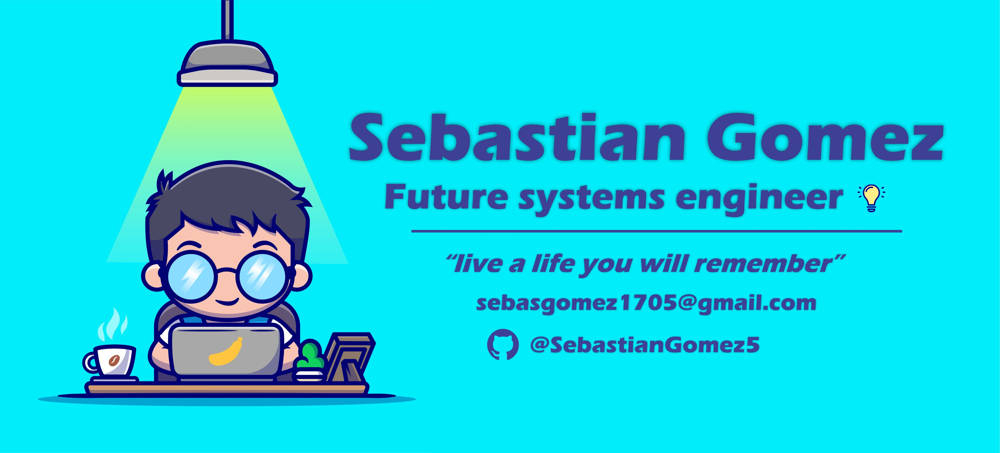

 

<h1 align="center">Hello world! 👋 I'm Sebastián Gómez</h1>

###

  🎓 <strong>Systems Engineering Student</strong> @<a href="https://www.univalle.edu.co/" target="_blank">Univalle</a> 
  💻 <strong>Web Developer</strong> at <a href="https://alvaropublicita.com" target="_blank">Álvaro Publicita</a> 
  🔧 <strong>Computer and printer repair technician </strong> at <a href="https://www.instagram.com/systemkolortulua/" target="_blank">System Kolor</a> 
  🧠 Lover of clean code, functional design, and good stories 
  🎯 My philosophy: "Every line of code is an opportunity to create impact"

###

<h2 align="left">About me</h2>

###

I'm passionate about technology, aesthetics, web design, automation, and, in general, digital solutions that truly transform brands. I'm inspired by my family, music, my faith, and my desire to make my mark on this world. 🌍✨

###

<h2 align="left">I code with</h2>

###

  
  
  
  
  
  
  
  
  
  
  
  
  
  
  
  
  
  
  
  
  
  
  
  
  
  
  
  
  
  
  

###

<h2 align="center">🤝 Shall we collaborate?</h2>

###

  

###

<h2 align="center">📊 My statistics</h2>

###

 

  
  
  
  

###
